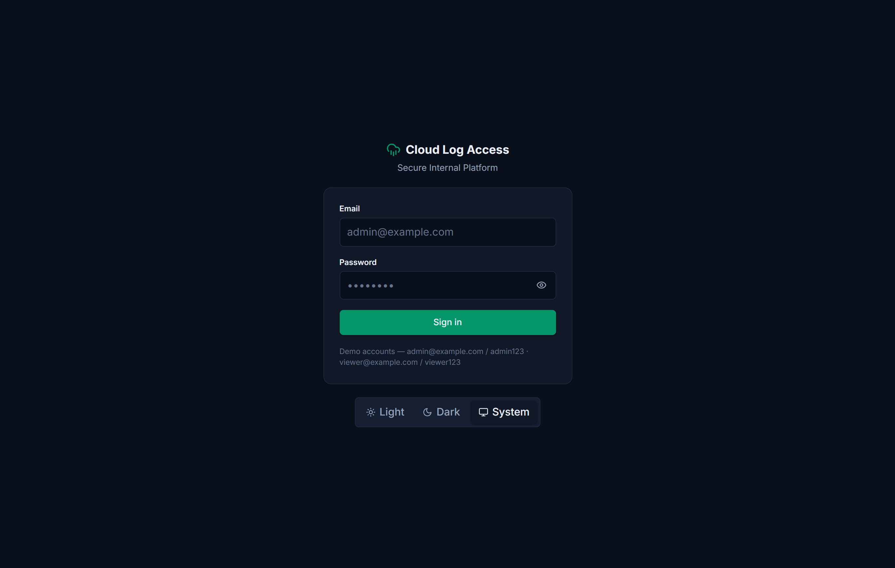
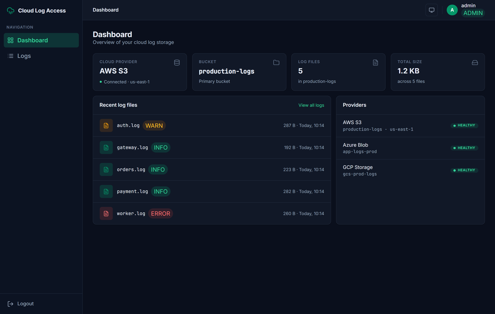
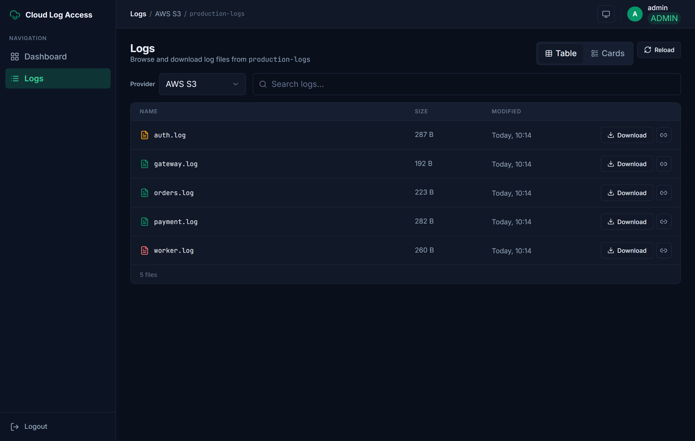
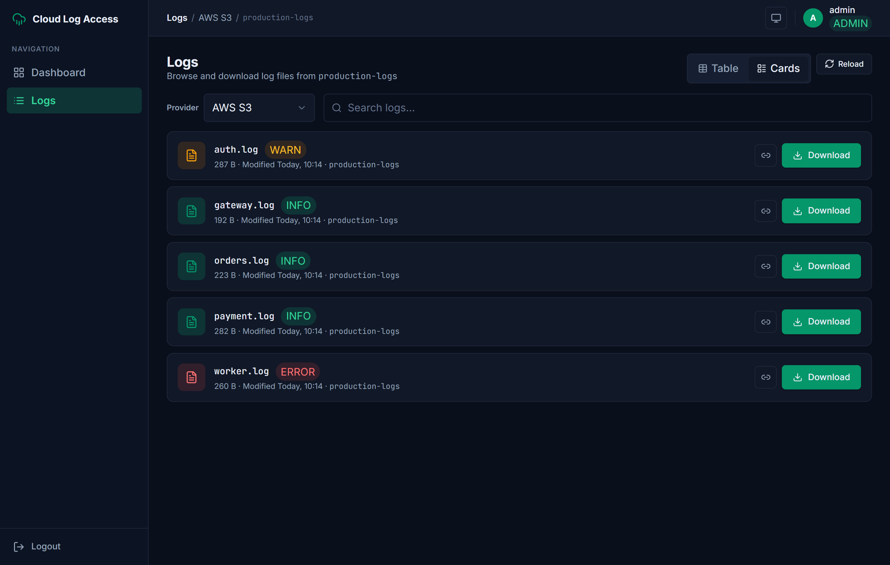
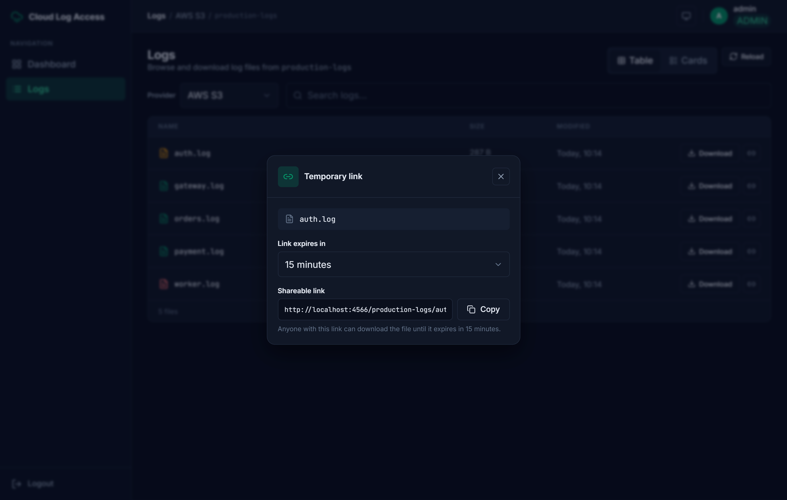
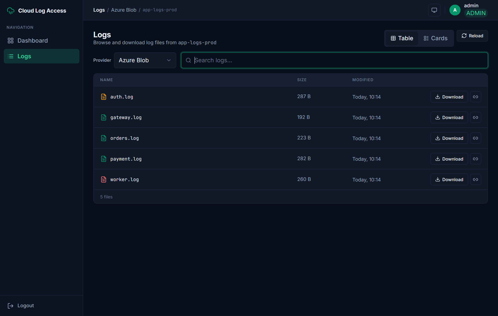
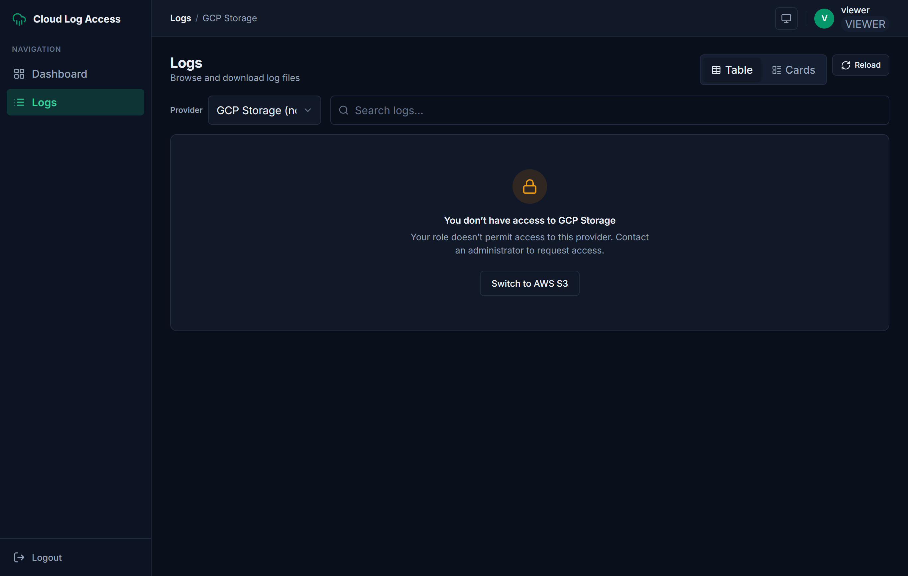
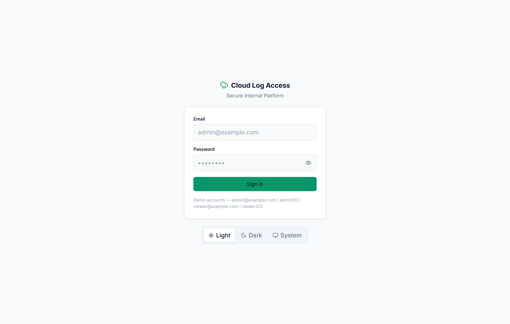

# Cloud Log Access Service

A secure **backend-for-frontend (BFF)** and web UI for browsing and downloading application log
files stored in cloud object storage — **AWS S3**, **Google Cloud Storage**, and **Azure Blob** —
behind authentication and role-based access control.


## What it does

- **List** log files in a bucket/container for a chosen cloud provider.
- **Download** a specific log file — streamed through the BFF, auth-enforced.
- **Temporary access links** — generate a short-lived pre-signed / SAS URL for a file *(bonus)*.
- **Auth & RBAC** — JWT login with `admin` / `viewer` roles; `viewer` is restricted to a subset of providers.
- Runs **entirely locally via Docker** against cloud emulators (LocalStack, fake-gcs-server, Azurite),
  seeded with sample logs at startup — **no real cloud accounts required**.

## Tech stack

| Layer | Stack |
|---|---|
| Backend (BFF) | Go 1.25 · chi v5 · golang-jwt v5 · official AWS / GCP / Azure SDKs · `slog` |
| Frontend | React 18 · Vite · TypeScript · Tailwind v3.4 · Zustand · TanStack Query |
| Local infra | Docker Compose · LocalStack (S3) · fake-gcs-server (GCS) · Azurite (Blob) |
| Bonus | Terraform (IaC) · GitHub Actions (CI) |

## Setup & run

> **Only Docker is required** (Compose v2) — no Go or Node toolchain.

**1. Set a JWT secret** (the BFF refuses to start without one):

```bash
echo "JWT_SECRET=$(openssl rand -base64 32)" > .env
```

**2. Start the full stack** — BFF + frontend + 3 cloud emulators + seeder:

```bash
# Recommended — pull the prebuilt images from Docker Hub (no build step):
docker compose -f docker-compose.images.yml up
#   → frontend  http://localhost:3000   ·   BFF  http://localhost:8080
#   images: pedrohrbispo/cloud-log-access-{bff,seed,frontend}  (pin a tag with IMAGE_TAG=v1.0.0)

# …or build everything from source instead:
make up
```

The seeder uploads the sample logs into all three emulators **before** the BFF starts, so the logs are
there on first load. Tear down with `docker compose -f docker-compose.images.yml down` (or `make clean`).

### Frontend (standalone)

The React SPA can run on its own with an in-browser mock of the API — no backend required — which is
the quickest way to see the UI and the full user journey:

```bash
cd frontend && npm install
npm run dev:mock   # http://localhost:5173  (mock BFF, demo creds below)
npm run dev        # http://localhost:5173  (proxies /api → the real BFF on :8080)
```

Demo logins: `admin@example.com / admin123` (all providers, can create temp links) ·
`viewer@example.com / viewer123` (AWS only, download-only).

**Frontend docs:** [`frontend/docs/ARCHITECTURE.md`](frontend/docs/ARCHITECTURE.md) — routes, screen map,
state management, and UI states · [`frontend/README.md`](frontend/README.md) — setup & design notes.

## User journey (screenshots)

The flow below walks the core journey (dark theme; all data is **real**, served by the BFF from the
emulators). The full set — including light theme, empty/error states, and the production container —
is in [`frontend/docs/screenshots/`](frontend/docs/screenshots).

**1. Login** — JWT auth; demo credentials shown on the card.



**2. Dashboard** — overview of the selected provider/bucket and recent log files.



**3. Logs — table view** — list, live search, per-row **Download** + temporary-link actions.



**4. Logs — cards view** — the same data in a denser layout with log-level badges.



**5. Temporary access link (admin)** — a short-lived URL with copy-to-clipboard and expiry.



**6. Multi-cloud** — switch the provider to Azure (or GCP); same UI, a different cloud.



**7. RBAC — no permission** — a `viewer` (AWS-only) is blocked from a restricted provider (`403`).



**8. Light theme** — light / dark / system theming.



## API

The versioned `/api/v1` contract — login, providers, list, download, and admin-only presign. A quick taste:

```bash
B=http://localhost:8080/api/v1
TOK=$(curl -s -X POST $B/auth/login -H 'Content-Type: application/json' \
  -d '{"email":"admin@example.com","password":"admin123"}' | jq -r .data.token)

curl -s $B/providers -H "Authorization: Bearer $TOK" | jq
curl -s "$B/providers/aws/logs?bucket=production-logs" -H "Authorization: Bearer $TOK" | jq
# admin-only temporary link (server clamps TTL to 15m max):
curl -s -X POST "$B/providers/aws/presign?bucket=production-logs" -H "Authorization: Bearer $TOK" \
  -H 'Content-Type: application/json' -d '{"key":"payment.log","ttl_seconds":900}' | jq
```

## Infrastructure as Code & CI

- **Terraform** ([`terraform/localstack/`](terraform/localstack/)) provisions the S3 bucket, a lifecycle
  policy, and seed objects against LocalStack — `terraform apply`, no real cloud account.
- **GitHub Actions** ([`.github/workflows/`](.github/workflows/)) runs gofmt/vet/build, `go test -race`,
  an S3 integration smoke test against a LocalStack service, and Docker image builds.

---

*Take-home exercise — not licensed for distribution.*
