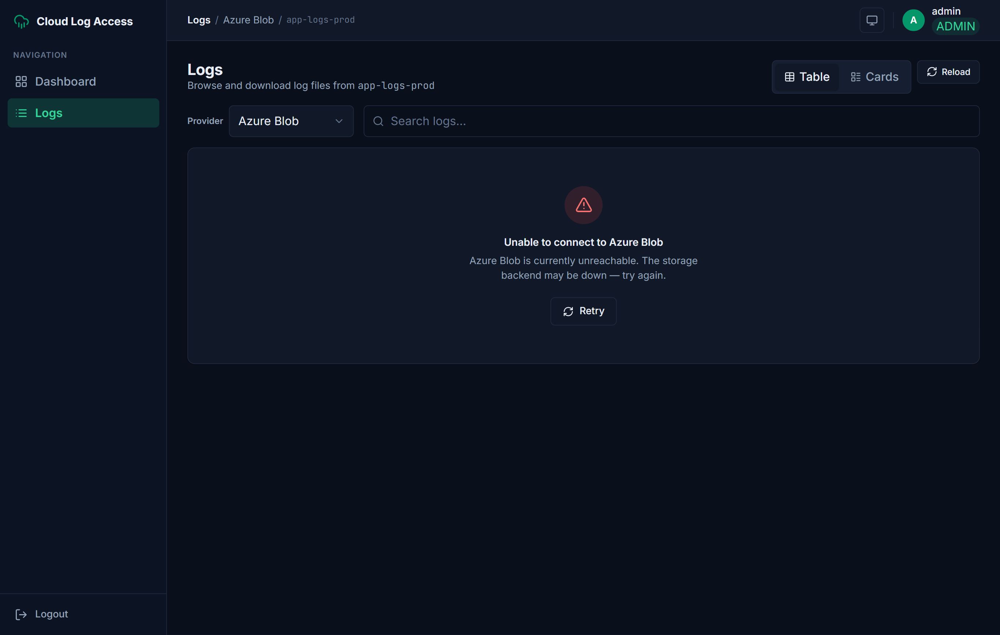
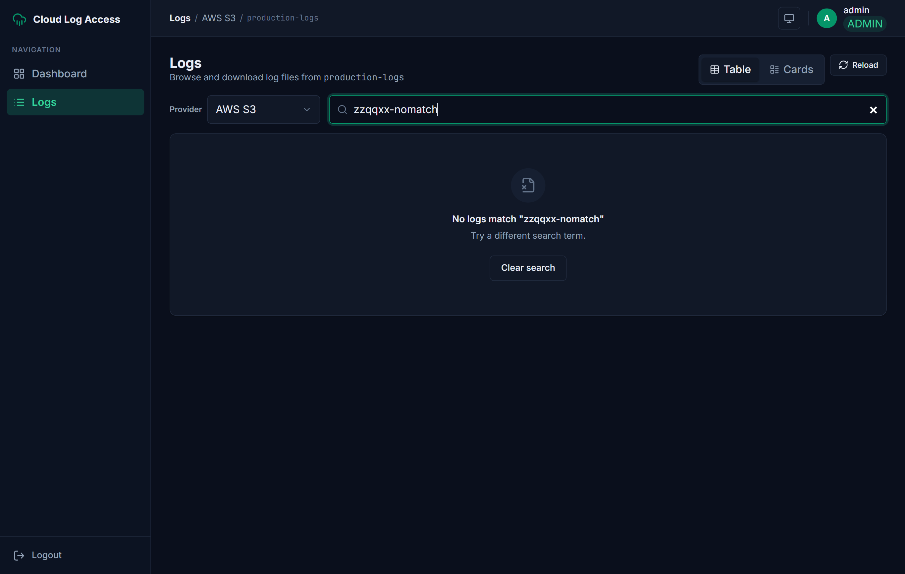
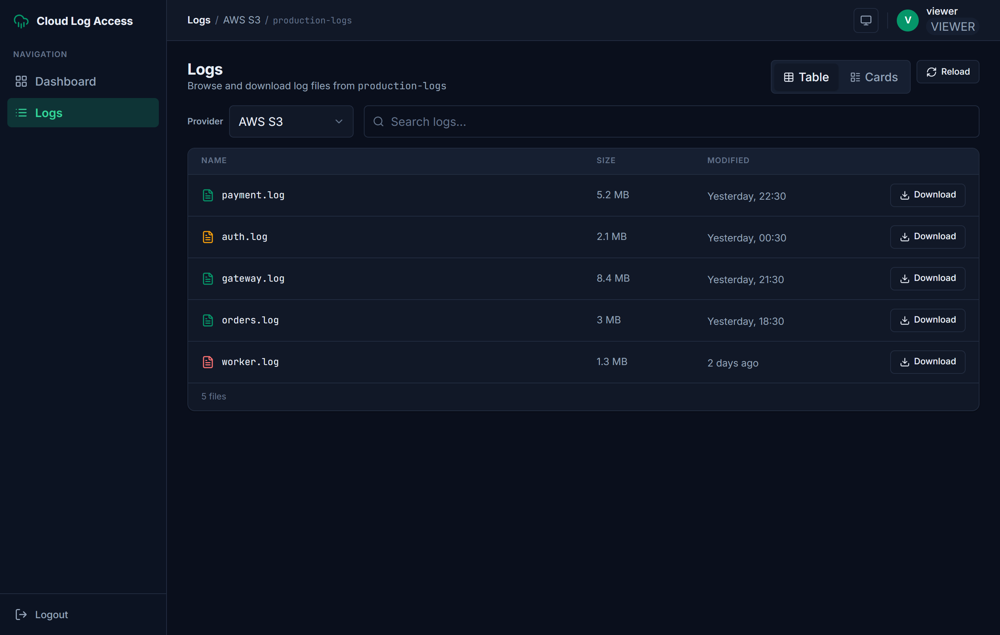
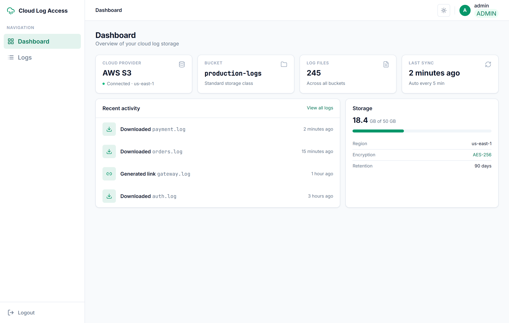

# Cloud Log Access — Frontend (React SPA)

A pixel-faithful React 18 single-page app for the **Cloud Log Access** service: a secure UI for
browsing and downloading application log files stored across AWS S3, GCP GCS, and Azure Blob,
behind JWT authentication and role-based access control. It talks to the Go BFF over the versioned
`/api/v1` contract.

> Part of the [Cloud Log Access Service](../README.md) monorepo. The backend (BFF) lives in
> [`../backend`](../backend) and is documented in [`../docs/PLAN.md`](../docs/PLAN.md).
>
> **Screen map & code organization:** [`docs/ARCHITECTURE.md`](docs/ARCHITECTURE.md) — every route,
> screen, and UI state, plus how the layers fit together. Original plan:
> [`../docs/FRONTEND-PLAN.md`](../docs/FRONTEND-PLAN.md).

## Tech stack

| Concern | Choice |
|---|---|
| Framework / build | React 18 · Vite 5 · TypeScript (strict: `noUncheckedIndexedAccess`, `exactOptionalPropertyTypes`) |
| Styling | Tailwind CSS v3.4 + a CSS-variable design-token layer (light / dark / system) |
| Global state | Zustand v5 (`persist`) — three purpose-split stores |
| Server state | TanStack Query v5 |
| Forms / validation | React Hook Form + Zod |
| Routing | React Router v6 (`createBrowserRouter`) |
| Icons | lucide-react |
| Mock API (dev/demo) | MSW (Mock Service Worker) |
| Prod serving | `nginx-unprivileged:1.27` (UID 101, port 8080) + `/api` reverse proxy |

## User journey (screenshots)

All screenshots are real renders of this implementation, captured headlessly **against the live Go
BFF** (LocalStack S3 + Azurite + fake-gcs-server). They live in [`docs/screenshots/`](docs/screenshots).

| | |
|---|---|
| **Login** (dark) — email/password, theme pill, seeded demo creds |  |
| **Dashboard** — live multi-cloud health + real file stats (composed from `/providers` + `/logs`) |  |
| **Logs — Table** (AWS S3) — dense AWS-console table, level-tinted icons, download + temp-link |  |
| **Logs — Cards** — Grafana-style row cards with INFO/WARN/ERROR badges |  |
| **Multi-cloud** — same UI against **Azure Blob** (Azurite) |  |
| **Temporary link** — real S3 **pre-signed URL**, copy, blast-radius helper |  |
| **Error state** — real `503` (Azure emulator stopped) → fail-fast + Retry |  |
| **Empty state** — live search with no matches |  |
| **RBAC — viewer** — temp-link action is absent (download-only) |  |
| **RBAC — no permission** — viewer switching to a restricted provider (real `403`) |  |
| **Light theme** — full light palette |  |

## Setup & run

Requires Node 20+ (built/tested on Node 20; CI uses Node 22).

```bash
cd frontend
npm install
```

### Option A — run with NO backend (in-browser mock) ⭐ quickest

Boots an MSW mock of the entire `/api/v1` contract (seeded with the demo data above), so the SPA
runs end-to-end with nothing else running:

```bash
npm run dev:mock      # http://localhost:5173
```

### Option B — run against the real Go BFF

Start the backend (see [`../docs/PLAN.md`](../docs/PLAN.md) — e.g. `make up` brings up the BFF +
LocalStack), then:

```bash
npm run dev           # Vite proxies /api → http://localhost:8080 (override with VITE_PROXY_TARGET)
```

### Option C — full stack via Docker Compose

From the repo root, once the backend image is available:

```bash
make up                       # or: docker compose up --build
# frontend → http://localhost:3000   (nginx serves the SPA and proxies /api → bff:8080)
```

### Demo credentials

| Role | Email | Password | Access |
|---|---|---|---|
| **admin** | `admin@example.com` | `admin123` | all providers · can create temp links |
| **viewer** | `viewer@example.com` | `viewer123` | AWS only · download-only (no temp links) |

The login card surfaces these on purpose (it's a take-home demo).

### Scripts

| Script | Does |
|---|---|
| `npm run dev` | Vite dev server (proxies `/api` to the BFF) |
| `npm run dev:mock` | Dev server with the in-browser mock BFF (`--mode mock`) |
| `npm run build` | `tsc --noEmit` + Vite build + CSP-hash injection |
| `npm run lint` / `npm run typecheck` | ESLint (jsx-a11y, react-hooks) / strict `tsc` |

## API contract consumed

All requests are same-origin under `/api/v1` (Vite proxy in dev, nginx proxy in prod → zero CORS).
Responses use `{ data, meta }` envelopes; errors use `{ error: { code, message, request_id } }`.

```
POST /api/v1/auth/login                 { email, password } → { token, token_type, expires_in, user }
POST /api/v1/auth/logout                                     (revokes token server-side; fire-and-forget)
GET  /api/v1/me                                             → { id, email, role, allowed_providers } (re-hydrate session)
GET  /api/v1/providers                                       → { providers: [{ id, name, buckets[], healthy, region? }] }
GET  /api/v1/providers/{p}/logs?bucket=&limit=               → { files: ObjectInfo[], next_cursor, count }
GET  /api/v1/providers/{p}/download?bucket=&key=             → streamed file (auth-enforced Bearer)
POST /api/v1/providers/{p}/presign?bucket=  { key, ttl_seconds } → { url, expires_at, ttl_seconds }   (admin)
```

The full as-built contract is in [`../docs/FRONTEND-INTEGRATION.md`](../docs/FRONTEND-INTEGRATION.md).
The dashboard is composed client-side from `/providers` + the primary bucket's `/logs` (there is no
`/summary` endpoint on the BFF).

`ObjectInfo` is exactly `{ key, size, last_modified, etag, content_type }`. The display fields
`filename`, `size_human`, and `level` (INFO/WARN/ERROR) are **derived client-side** — `level` is a
deterministic filename heuristic (`/error|fail|worker/i → error`, `/warn|auth/i → warn`, else
`info`), documented as such, not real server metadata.

### Example: login

```bash
curl -s localhost:5173/api/v1/auth/login -H 'content-type: application/json' \
  -d '{"email":"admin@example.com","password":"admin123"}'
```
```json
{
  "data": {
    "token": "eyJhbGciOi...",
    "token_type": "Bearer",
    "expires_in": 3600,
    "user": { "id": "u-admin", "email": "admin@example.com", "role": "admin", "allowed_providers": null }
  },
  "meta": { "request_id": "…", "timestamp": "2026-06-30T00:00:00Z" }
}
```

## Design decisions

- **Authenticated streaming download (not a redirect).** The core Download path `fetch`es the
  BFF download endpoint with the `Bearer` token, reads a `Blob`, and saves it via a hidden anchor —
  so auth is enforced for every download. `.blob()` buffers the whole file in memory (fine for log
  files; the production upgrade is `ReadableStream` + StreamSaver). Pre-signed URLs are a *separate*
  feature and are **copied / navigated, never `fetch`ed** (they point at a different origin → CORS).
- **RBAC is enforced in the UI, not just hinted.** A viewer's temp-link button is **DOM-absent**
  (gated by `useIsAdmin()`), not merely disabled — so the action can't be triggered. Switching to a
  provider outside `allowed_providers` shows a dedicated **amber "no access"** state *with no network
  call*; a defensive `403 PROVIDER_NOT_ALLOWED` from the API routes to the same state, while a
  `503 STORAGE_UNAVAILABLE` routes to the red "connection error" state. The real authority is always
  the backend; the UI mirrors it for good UX.
- **Session in a centralized, persisted, cross-tab store.** `authStore` (Zustand `persist`) holds
  `{ token, user, isAuthenticated }`; a `storage`-event listener syncs login/logout across tabs. On
  load the app revalidates the persisted session against `GET /me` (refreshing `allowed_providers`); a
  revoked/expired token `401`s and is caught by the global redirect. A global `401` for a lost session
  (`TOKEN_EXPIRED/INVALID/MISSING`) hard-redirects to `/login?reason=expired`; a login `401`
  (`INVALID_CREDENTIALS`) deliberately does **not** redirect, so it can surface inline.
  (localStorage-JWT XSS tradeoff is accepted and mitigated by the 1h TTL + strict CSP — see below.)
- **Dashboard composed from real endpoints + fail-fast health.** The BFF has no `/summary` endpoint,
  so the dashboard is built from `/providers` (live per-provider health probe) + the primary bucket's
  `/logs` — real file counts, sizes, and a multi-cloud health panel. The logs view also trusts the
  `healthy:false` signal: it routes a known-unreachable provider straight to the error state instead
  of firing a doomed (hanging) request, and `Retry` re-probes `/providers`.
- **One green token re-skins the app.** `--primary: #059669` (+ a `*-strong` AA text family) is the
  single source of truth; light/dark/system themes swap a CSS-variable layer. A tiny inline
  `<head>` script resolves the theme **before first paint** (no flash) and is whitelisted in the CSP
  by its **sha256 hash** (auto-recomputed at build by `scripts/csp-hash.mjs`).
- **Accessibility as the engineering delta.** Real semantic `<table>`, labelled icon-only buttons,
  a focus-trapped `role="dialog"` modal (Esc / click-outside / focus-return), `role="status"`/`alert`
  toasts, an arrow-key `radiogroup` theme/view control, `prefers-reduced-motion` handling, and an
  AA-passing accent-text token family.
- **Three Zustand stores, split by purpose.** `authStore` (session), `uiStore` (theme/view/provider/
  search; only view+provider persisted), `toastStore` (transient download feedback). Server state is
  TanStack Query; modal lifecycle is local component state.

## Security headers (prod)

`nginx.conf` sets a strict CSP — `default-src 'self'`, the inline theme script whitelisted by
sha256, `connect-src 'self'`, `frame-ancestors 'none'` — plus `X-Content-Type-Options`,
`X-Frame-Options: DENY`, and `Referrer-Policy`. The Authorization header is passed through to the
BFF; downloads stream (`proxy_buffering off`).

## Project structure

```
src/
├── api/        client (envelope unwrap, 401 routing, downloadToBlob) · auth (login/logout/me) · providers · logs · presign · types
├── store/      authStore (cross-tab) · uiStore · toastStore
├── router/     createBrowserRouter · ProtectedRoute (auth + role guard)
├── hooks/      useProviders · useLogs · useDownload · useTempLink · useMe · useIsAdmin · useMediaQuery
├── pages/      LoginPage · LogsPage (state machine) · DashboardPage
├── components/ ui/ (primitives) · layout/ (shell, sidebar, topbar) · logs/ · dashboard/
├── lib/        cn · format (bytes/time/level) · theme · constants
├── styles/     tokens · keyframes · base · index
└── mocks/      MSW handlers + worker (dev/demo only)
```
